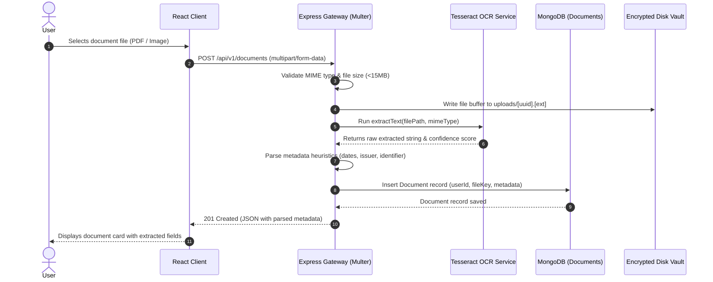
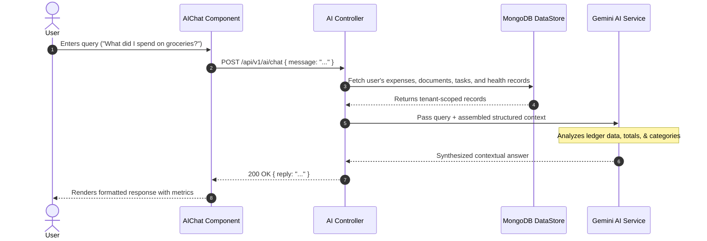

# 🏛 LifeSync AI: System Architecture & Security Specification

This document details the decoupled 3-tier architecture, request pipelines, security topology, and data flows of **LifeSync AI**.

---

## 1. High-Level Architectural Topology

```
+-------------------------------------------------------------------------+
|                              CLIENT TIER                                |
|          React 19 SPA + Vite + Tailwind CSS v4 + Lucide Icons           |
|  - Routing: React Router DOM v7 (Protected Routes via AppLayout)        |
|  - State: AuthContext (JWT storage & validation), ToastContext          |
|  - HTTP: Axios Client with Request & Response Interceptors              |
+-------------------------------------------------------------------------+
                                    │
                                    │ HTTPS / REST API (Bearer JWT)
                                    ▼
+-------------------------------------------------------------------------+
|                          API GATEWAY TIER                               |
|                     Node.js LTS + Express 5.x Framework                 |
|  - Security: Helmet.js, Express-Rate-Limit, CORS Policy                |
|  - Upload Pipeline: Multer (Disk Storage, UUID keys, MIME checks)       |
|  - Route Dispatcher: /api/v1 (Auth, Documents, Expenses, Health, Tasks)  |
|  - Global Error Handler & Request Timing Diagnostics                    |
+-------------------------------------------------------------------------+
          │                                  │
          ▼                                  ▼
+-----------------------+          +--------------------------------------+
|  OCR & AI PIPELINE    |          |            DATABASE TIER             |
| - Tesseract.js Engine |          | MongoDB Atlas / Mongoose ODM         |
| - Gemini 2.5 Flash SDK|          | - Users, Documents, Expenses, Tasks, |
| - Local RAG Heuristics|          |   HealthRecords                      |
+-----------------------+          | - Resilient Local Fallback Engine    |
                                   +--------------------------------------+
```

---

## 2. Request Lifecycle & Security Middleware Pipeline

When a client initiates an HTTP request, it traverses a structured defense-in-depth pipeline:

```
Incoming Request
       │
       ▼
 [ 1. Helmet Middleware ] ──> Injects CSP, X-Frame-Options, HSTS headers
       │
       ▼
 [ 2. CORS Whitelist ] ──> Validates client origin against trusted origins
       │
       ▼
 [ 3. Rate Limiter ] ──> Enforces 300 requests / 15 minutes window
       │
       ▼
 [ 4. Body / Multipart Parsers ] ──> Handles JSON (10MB limit) or Multer form-data
       │
       ▼
 [ 5. JWT Auth Verification ] ──> Validates Bearer signature & extracts req.user
       │
       ▼
 [ 6. Controller & Isolation ] ──> Enforces tenant filter: { userId: req.user.id }
       │
       ▼
 [ 7. Database / Service Layer ] ──> Mongoose ODM or fallback store
       │
       ▼
 Client Response (JSON)
```

---

## 3. Document Ingestion & Optical OCR Sequence



---

## 4. Contextual AI Copilot (RAG Pipeline)



---

## 5. Security & Privacy Guarantees

1. **Multi-Tenant Data Isolation**: Database documents are partitioned by the indexed `userId` foreign key. Cross-tenant reads, updates, and deletes are structurally prevented at the controller layer.
2. **Identifier Redaction**: Sensitive government and financial credentials (e.g. Tax IDs, Social Security numbers) undergo automated pattern detection and redaction, displaying only masked tokens (e.g., `XXXX-XXXX-4819`).
3. **Stateless Authentication**: Access is authenticated using signed JSON Web Tokens containing user metadata and an expiration timestamp.
4. **Physical Vault Isolation**: Uploaded files are renamed using cryptographically secure v4 UUIDs and stored outside public web directories. File downloads require an active session and ownership validation.
